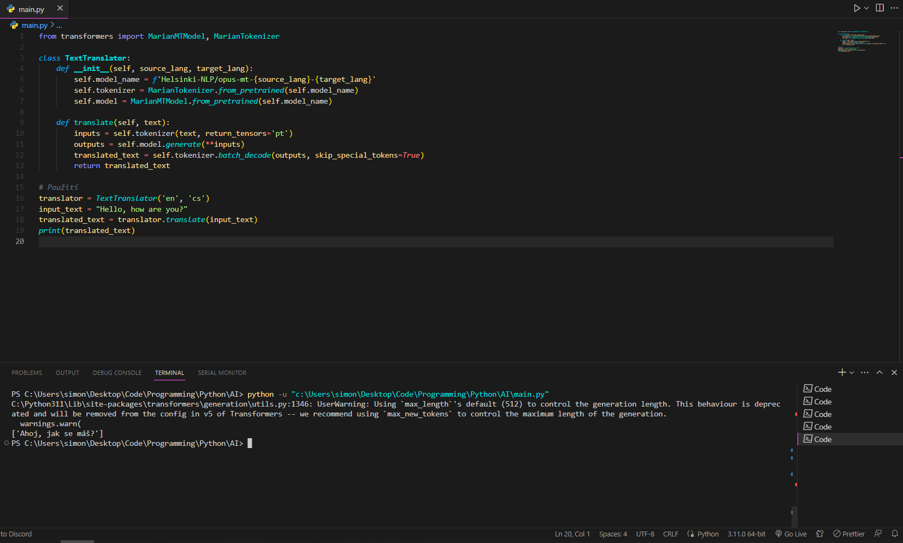

># **Artificial Intelligence**
>## ***Created by Ghost***
>## It was a school project and I decided to create an AI text conversion.
>## Creating this AI required some libraries:
>>- pip install torch
>>- pip install transformers
>>- pip install sentencepiece
>>- pip install sacremoses
***
>## **Step 1**
>>### Import all the necessities - translation model, tokenezing model from transformers library
***
>## **Step 2**
>>### Defining the TextTranslator Class
***
```python
 def __init__(self, source_lang, target_lang):
        self.model_name = f'Helsinki-NLP/opus-mt-{source_lang}-{target_lang}'
        self.tokenizer = MarianTokenizer.from_pretrained(self.model_name)
        self.model = MarianMTModel.from_pretrained(self.model_name)
```
***
>## **Step 3**
>>### Defining the translate Method
***
```python
def translate(self, text):
    inputs = self.tokenizer(text, return_tensors='pt')
    outputs = self.model.generate(**inputs)
    translated_text = self.tokenizer.batch_decode(outputs, skip_special_tokens=True)
    return translated_text
```
***
>## **Step 4**
>>### Usage Example
***
```python
translator = TextTranslator('en', 'cs')
input_text = "Hello, how are you" #put your text here in english
translated_text = translator.translate(input_text)
print(translated_text)
```
***
>## **Screenshot after running the code with terminal**
>>
***


