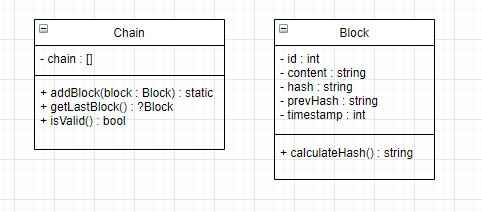

># Blockchain School Project

***
>## What is this project
>> ### It is a blockchain-based storage implementation in PHP. This repository allows you to store blocks with certain content that are linked together using hashing functions.
***
># How to use
>> ### You must first create an instance of the Chain class. You can then add blocks using the addBlock() method and retrieve the last block using the getLastBlock() method. You can also validate the entire blockchain using the isValid() method. Here is an example code:
***

***
```php
$chain = new Chain();
$chain->addBlock(new Block(1, 'Hello!'));
$chain->addBlock(new Block(2, 'Goodbye!'));

if ($chain->isValid()) {
    echo "Blockchain is valid.\n";
    echo "Last block content: " . $chain->getLastBlock()->content . "\n";
} else {
    echo "Blockchain is not valid!\n";
}
```
***

> # UML Class Diagram
***
>
***