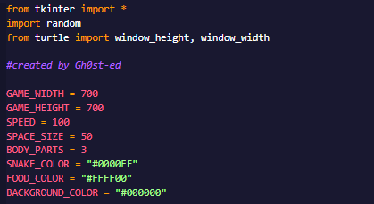
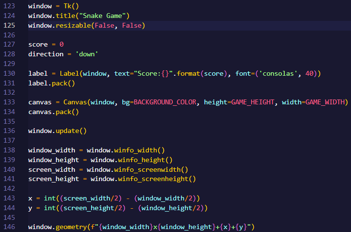
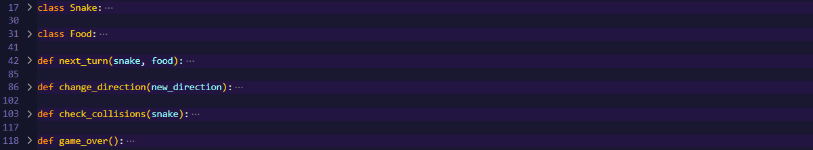
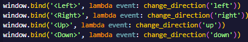

> # Python Snake Game Project
***
> ### Jen sděluji, že si nechávám odmazávat vykřičník z WAP a dělám jen 2 trestné úlohy z SI - README.md a UML diagram.

> ### This project was created as homework for programming class in second year of high school.

> ### Let's describe the code in Parts.
>> When you will examine this .md file, you should have the code opened because of closed classes in the code so you can open them and understand the code better
>>> Created by Gh0st-ed

***
> 1. First step was to import modules and create variables that we used later.
***
* import modules for creating window later
* creating constants that we'll use later in code

***
>>
***

***
> 2. Second step was to create GUI.
***

* creating not resizable window (lines 123-125)
* creating label for score text (lines 130,131)
* using canvas to create gameboard (lines 133,134)
* centering and updating window (lines 136-141)
* adjusting position of window (lines 143,144)
* window geometry (line 146)

***
>>
***

***
> 3. Third step was to create classes and define fuctions for movement.
***

* class Snake - Constructing Snake object, spawn, part nad shape (canvas) (lines 17-29)
* class Food - Constructing Food object, random spawn (self.coordinates) and shape of food (canvas) (lines 31-40)
* function next_turn - Creating movement of snake and moving parts, coordinates and score. Y- = UP, Y+ = down, X- = left, X+ = right, we need to call this function on the end of the cod,(lines 42-85)
* function next_turn - making the food edable and adding it to the score (lines 61-81)
* creating controls of the snake. Binding them to arrows (lines 148-151)
* function change direction - making the controls functional (lines 86-101)
* function check_collisions - checking if the snake has touched the border of the gameboard so we can lose (using width - x and height - y) (lines 103-116)
*function game_over - will delete all on gameboard and will generate large GAME OVER text over the screen (lines 118-121)

***
>>
***

***
>>
***
